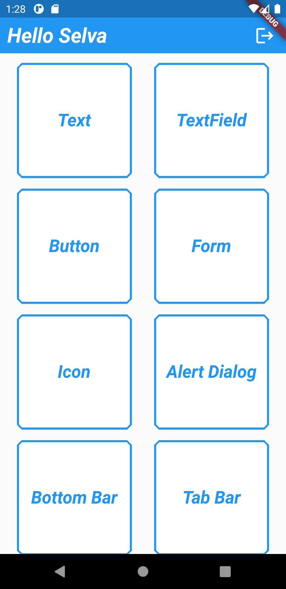
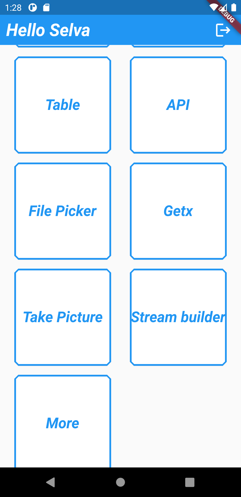

<h2 align="center">
Flutter Basics
</h2>

<h3 align="center">
Useful flutter widgets and its implementation
</h3>

<h4 align="center">
Available for Android and iOS.
</h4>

 

## Demo

<h4 align="center">
Home Screen
</h4>

   
   

